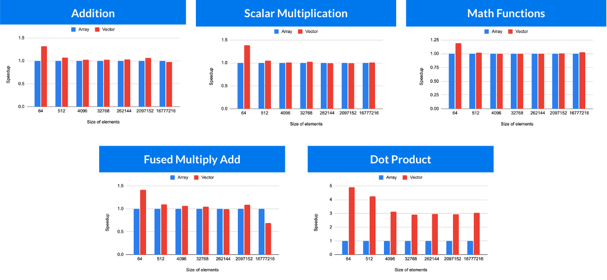
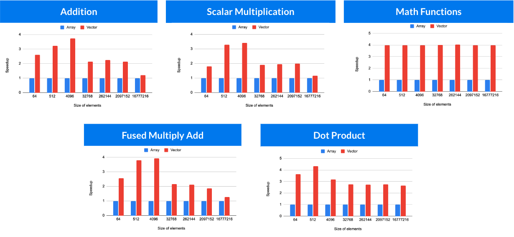

# JDK 25 Vector API Benchmark Demo

A comprehensive demonstration of Java's Vector API (incubator) introduced in JDK 25, showcasing SIMD (Single Instruction, Multiple Data) performance improvements through various benchmarking approaches.

## Overview

This project demonstrates the performance benefits of using Java's Vector API for mathematical operations compared to traditional scalar implementations. It includes both simple timing-based benchmarks and professional JMH (Java Microbenchmark Harness) benchmarks.

## Features

- **Multiple Benchmark Types**: Vector addition, scalar multiplication, dot product, fused multiply-add, and mathematical functions
- **Dual Benchmarking Approaches**: 
  - Simple timing-based benchmarks (educational only)
  - Professional JMH benchmarks
- **Performance Comparison**: Side-by-side comparison of scalar vs vectorized implementations
- **Fair vs Unfair Testing**: Demonstrates Vector API advantages under different JVM optimization settings

## Requirements

- **JDK 25** (required for Vector API support)
- **Maven** (for JMH benchmarks)
- **CPU with SIMD support** (x86-64 with SSE/AVX or ARM with NEON for optimal performance)

## Quick Start

### Basic Demo
```bash
# Compile and run the basic benchmark demo
make run

# Run with performance optimizations (fair comparison)
make benchmark

# Show system and Vector API information
make info
```

### JMH Benchmarks
```bash
# Quick JMH benchmarks (faster, less accurate)
make jmh-quick

# Comprehensive JMH benchmarks (slower, more accurate)
make jmh-run
```

## Fair vs Unfair Benchmark Results

### Fair Comparison (Default JVM Settings)
In a **fair comparison**, both scalar and vector implementations benefit from JVM optimizations:
- **SuperWord optimization enabled**: The JVM can auto-vectorize simple scalar loops
- **Both approaches optimized**: More realistic real-world performance comparison
- **Moderate speedups**: Vector API shows benefits but not extreme differences

```bash
# Run fair benchmarks
make benchmark
make jmh-quick
```

### Unfair Comparison (SuperWord Disabled)
In an **unfair comparison**, we disable JVM auto-vectorization for scalar code:
- **SuperWord optimization disabled**: Scalar loops cannot be auto-vectorized
- **Vector API unaffected**: Still uses SIMD instructions
- **Maximum speedups**: Shows the theoretical maximum advantage of explicit vectorization

```bash
# Run unfair benchmarks (SuperWord disabled)
make benchmark-unfair
make jmh-quick-unfair
```

### Results Interpretation

#### Fair Results (JVM Auto-vectorization Enabled)


#### Unfair Results (SuperWord Disabled)


The unfair comparison demonstrates:
- **Educational value**: Shows what Vector API can achieve when scalar code isn't optimized
- **Worst-case scenarios**: Performance in environments where auto-vectorization fails
- **API potential**: Maximum theoretical speedups possible with explicit vectorization

The fair comparison shows:
- **Real-world performance**: How Vector API performs against optimized scalar code
- **Production relevance**: More realistic performance expectations
- **Optimization interaction**: How explicit and automatic vectorization compare

## Project Structure

```
src/main/java/org/perujug/
├── Main.java                          # Entry point
├── base/
│   ├── BenchmarkBase.java            # Base benchmark utilities
│   └── VectorInfo.java               # Vector API system information
├── benchmarks/                       # Individual benchmark implementations
│   ├── VectorAdditionBenchmark.java
│   ├── ScalarMultiplicationBenchmark.java
│   ├── DotProductBenchmark.java
│   ├── FusedMultiplyAddBenchmark.java
│   └── MathFunctionsBenchmark.java
├── runners/
│   ├── BenchmarkRunner.java          # Simple benchmark runner
│   ├── BenchmarkComparison.java      # Methodology comparison
│   └── JmhRunner.java               # JMH benchmark runner
└── jmh/
    └── JmhVectorBenchmarks.java      # JMH benchmark suite
```

## Available Commands

| Command | Description |
|---------|-------------|
| `make run` | Basic benchmark demo |
| `make benchmark` | Optimized fair comparison |
| `make benchmark-unfair` | Unfair comparison (SuperWord disabled) |
| `make jmh-quick` | Quick JMH benchmarks |
| `make jmh-run` | Comprehensive JMH benchmarks |
| `make jmh-quick-unfair` | Quick JMH benchmarks (unfair) |
| `make jmh-unfair` | Comprehensive JMH benchmarks (unfair) |
| `make info` | System and Vector API information |
| `make benchmark-comparison` | Benchmarking methodology explanation |
| `make clean` | Clean build artifacts |

## Benchmarking Methodology

This project demonstrates three levels of benchmarking sophistication:

### 1. Naive Benchmarking ❌
- Single measurement without warmup
- No result consumption (dead code elimination risk)
- No statistical analysis

### 2. Improved Manual Benchmarking ✅ (Used in basic demo)
- JVM warmup iterations
- Multiple measurements with averaging
- Result consumption to prevent optimizations
- Comparative analysis

### 3. JMH Gold Standard 🏆 (Professional benchmarks)
- Advanced warmup and optimization detection
- Statistical rigor with confidence intervals
- Dead code elimination protection
- Fork isolation and GC control

Run `make benchmark-comparison` to see a detailed explanation of these approaches.

## Understanding the Results

### Vector API Benefits
- **Explicit SIMD**: Direct control over vectorization
- **Predictable performance**: Not dependent on JVM heuristics
- **Complex operations**: Better for operations JVM can't auto-vectorize
- **Future-proof**: Consistent behavior across JVM versions

### When to Use Vector API
- **Performance-critical code**: Numerical computations, signal processing
- **Predictable vectorization**: When auto-vectorization is unreliable
- **Complex SIMD patterns**: Operations beyond simple loops
- **Cross-platform consistency**: Consistent SIMD behavior

## Contributing

This is a demonstration project for educational purposes. Feel free to:
- Add new benchmark scenarios
- Improve benchmarking methodology
- Add support for different data types
- Enhance documentation and examples

## License

Open source demonstration project. Feel free to use and modify for educational purposes.

## Additional Resources

- [OpenJDK Vector API Documentation](https://openjdk.org/jeps/508)
- [JMH Documentation](https://openjdk.java.net/projects/code-tools/jmh/)
